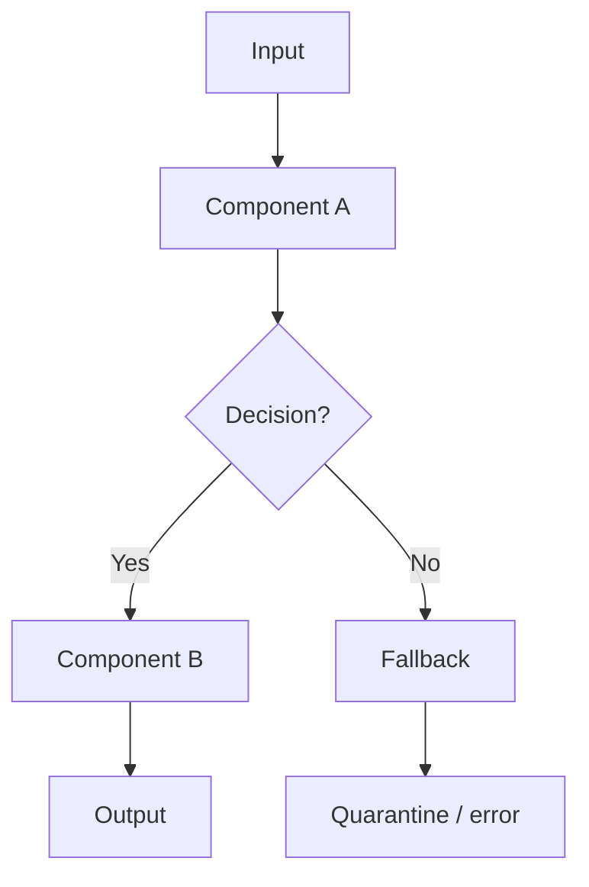

<!-- type: explanation -->

# Architecture

High-level design. Read on demand; keep it an index, not a dump.

## Overview

- <system purpose, key properties>

## Data flow

## Layers

| Layer | Responsibility | Key classes | Depends on |
|---|---|---|---|
| <layer> | <what it does> | <main types> | <dependencies> |

## Cross-cutting decisions

- <bullet list of key architectural choices with rationale>

## Data model

- <entity list with key fields, or pointer to schema>

## Implementation plan

See [roadmap.md](roadmap.md) for phased progress tracking.

---

[← Back to docs index](index.md)
